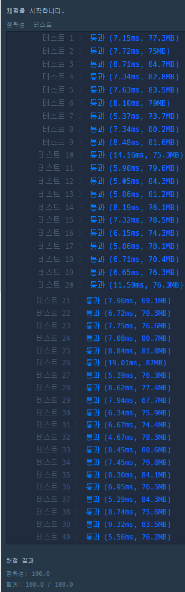

### 코드

```java
import java.util.*;

class Solution {
    // 중복 순열
    // dfs의 순서 -> 다 구하고 list에 저장된 순서
    static String[] arr;
    static String target;
    static ArrayList<String> result;
    
    public void DFS(int idx, String now) {
        String tmp = now + arr[idx];
        // 종료 조건이 아니면 계속 진행
        if (now.length() >= 5) {
            return;
        }
        result.add(tmp);
        
        for (int i = 0; i < 5; i++) {
            DFS(i, tmp);
        }
    }
    
    public int solution(String word) {
        arr = new String[]{"A", "E", "I", "O", "U"};
        result = new ArrayList<>();
        target = word;
        
        for (int i = 0; i < arr.length; i++) {
            DFS(i, "");
        }
                
        int answer = 0;
        for (int i = 0; i < result.size(); i++) {
            if (target.equals(result.get(i))) {
                answer = i+1;
                break;
            }
        }
        return answer;
    }
}
```

