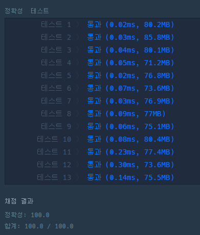

### 코드

```java
class Solution {
    
    static int answer = 0;
    static boolean[] visited;
    
    public void DFS(int now, int[][] computers) {
        
        for (int i = 0 ; i < computers[now].length; i++) {
            int next = computers[now][i];
            
            if (i != now && next == 1) {
                if (!visited[i]) {
                    visited[i] = true;
                    DFS(i, computers);
                }
            }
        }
    }
    
    public int solution(int n, int[][] computers) {
        visited = new boolean[n];
        
        for (int i = 0; i < n; i++) {
            if (!visited[i]) {
                answer += 1;
                visited[i] = true;
                DFS(i, computers);
            }
        }
        
        return answer;
    }
}
```

