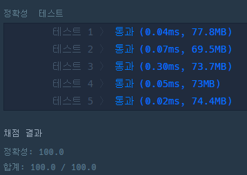

### 코드
```java
import java.util.*;

class Solution {
    
    static int answer = Integer.MAX_VALUE;
    static int n;
    static boolean[] visited;
    
    public boolean check(String target, String now) {
        int flag = 0;
        
        for (int i = 0; i < target.length(); i++) {
            if (target.charAt(i) != now.charAt(i)) {
                flag ++;
            }
            
        }
        
        if (flag == 1) {
            return true;
        }
        return false;
    }
    
    public void DFS(String target, String now, int cnt, String[] words) {
        if (target.equals(now)) {
            answer = Math.min(answer, cnt);
        }
        
        for (int i = 0; i < n; i++) {
            if (!visited[i] && check(now, words[i])) {
                
                visited[i] = true;
                DFS(target, words[i], cnt + 1, words);
                visited[i] = false;
            }
            
        }
    }
    
    public int solution(String begin, String target, String[] words) {
        n = words.length;
        visited = new boolean[n];
        
        DFS(target, begin, 0, words);
        if (answer == Integer.MAX_VALUE) {
            answer = 0;
        }
        return answer;
    }
}
```

