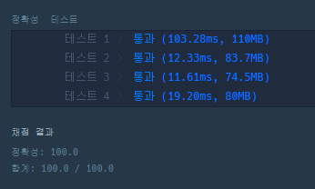

### 코드
```java
import java.util.*;

class Solution {
    
    static ArrayList<String> ans = new ArrayList<>();
    static boolean[] visited;
    static int n;
    
    private static void DFS (int cnt, String now, String path, String[][] tickets) {
        // 방문 경로는 모두 담기!!
        if (tickets.length == cnt) {
            ans.add(path);
        }
        
        for (int i = 0; i < tickets.length; i++) {
            if (!visited[i] && now.equals(tickets[i][0])) {
                visited[i] = true;
                DFS (cnt + 1, tickets[i][1], path + " " + tickets[i][1], tickets);
                visited[i] = false;
            }
        }
    }
    
    public String[] solution(String[][] tickets) {
        n = tickets.length;
        visited = new boolean[n];
        
        // 시작
        for (int i = 0; i < tickets.length; i++) {
            // 출발지는 항상 인천
            if (tickets[i][0].equals("ICN")) {
                visited[i] = true;
                DFS (1, tickets[i][1], "ICN " + tickets[i][1], tickets);
                visited[i] = false;
            }
        }
        
        Collections.sort(ans);
        String[] answer = ans.get(0).split(" ");
        return answer;
    }
}

