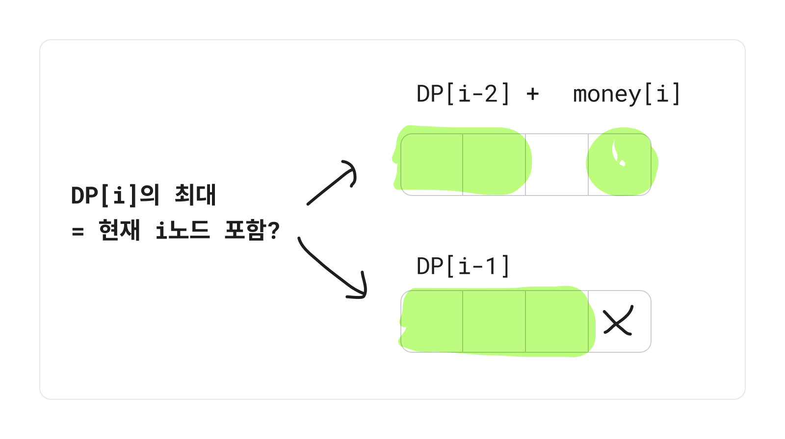

### 코드

- DP[i]의 값은 현재 i 노드 포함 여부에 따라 달라짐 - 연속 2칸 X
  - 현재 노드 포함일 경우, 바로 이전 칸은 빼야함! => 전전칸까지의 DP
  - 현재 노드 제외일 경우, 전칸까지의 DP
- **예외 처리**
  - 선형이므로 첫 번째집과 마지막집을 동시에 뽑지 않도록 체크해주기
  - 첫번째 집 포함 DP => 마지막 집을 뺀 DP (1 ~ n-1)
  - 첫번째 집 배제 DP => 마지막 집까지의 DP (2 ~ n)



```java
import java.util.*;

class Solution {
    public int solution(int[] money) {
        int n = money.length;

        // 1. 첫 번째도 털 수 있는 경우 - 마지막은 무조건 X
        int[] dp = new int[n];

        dp[0] = money[0]; // 첫 번째도 DP에 포함!
        dp[1] = Math.max(money[0], money[1]);

        for (int i = 2; i < n-1; i++) {
            int now = dp[i-2] + money[i];
            int exceptNow = dp[i-1];
            dp[i] = Math.max(now, exceptNow);
        }

        // 2. 첫 번째는 아예 안 털 경우 - 마지막이 포함될 수도 있음
        int[] dpExceptFirst = new int[n];

        dpExceptFirst[1] = money[1];

        for (int i = 2; i < n; i++) {
            int now = dpExceptFirst[i-2] + money[i];
            int exceptNow = dpExceptFirst[i-1];
            dpExceptFirst[i] = Math.max(now, exceptNow);
        }

        int containFirst = dp[n-2];
        int exceptFirst = dpExceptFirst[n-1];
        int result = Math.max(containFirst, exceptFirst);

        return result;
    }
}
```