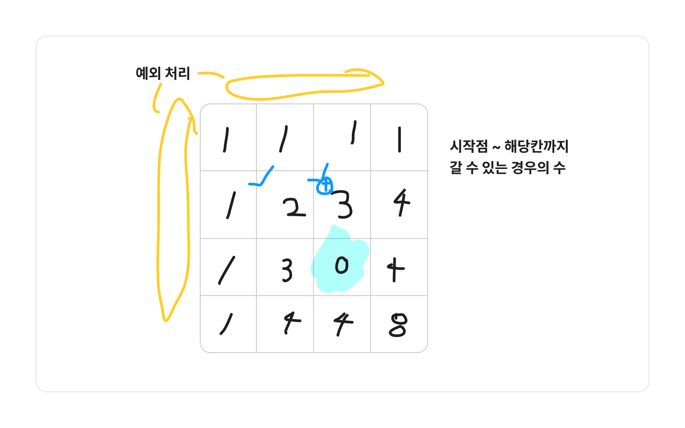
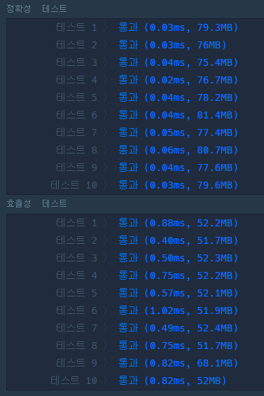

### 코드

- int[][] map(DP 저장 배열)에 시작점~해당 칸까지 갈 수 있는 경우의 수 구하기
- 이동 가능 방향은 오른쪽, 아래이므로
- DP는 왼쪽, 윗칸의 값을 더해주어야 함
- **예외 처리** 
  - 물 웅덩이는 0으로 계산(해당 칸까지 갈 수 없으므로)
  - 첫 행, 첫 열
  - 

```java
import java.util.*;

class Solution {
    public int solution(int m, int n, int[][] puddles) {
        
        boolean[][] isPuddle = new boolean[n][m];
        int[][] map = new int[n][m];
        
        for (int[] pud : puddles) {
            int x = pud[1];
            int y = pud[0];
            
            isPuddle[x-1][y-1] = true;
        }
        
        // 시작점
        map[0][0] = 1;
        for (int i = 0; i < n; i++) {
            for (int j = 0; j < m; j++) {
                // 물 웅덩이면 연산 X
                if (isPuddle[i][j]) {
                    continue;
                }
                
                // 오른쪽, 아래만 이동 가능
                // => 왼쪽, 윗칸값과 더하기
                if (i != 0) {
                    map[i][j] = (map[i][j] + map[i-1][j]) % 1000000007;
                }
                if (j != 0) {
                    map[i][j] = (map[i][j] + map[i][j-1]) % 1000000007;
                }
            }
        }
        return map[n-1][m-1];
    }
}
```

