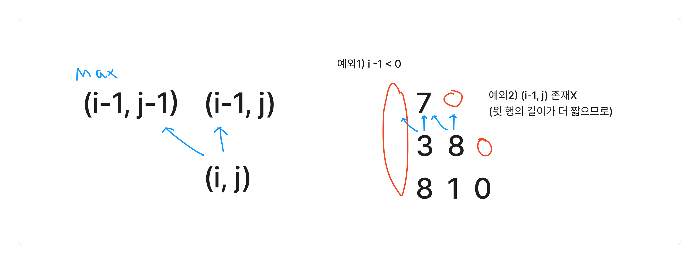
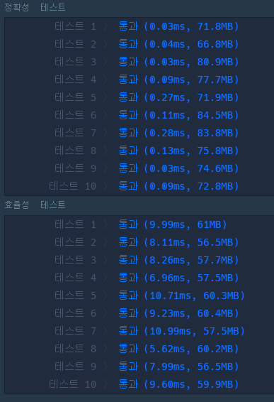

### 코드

- DP로 윗행들 중 최댓값만 더해가면서 풀이
- 예외 처리


```java
import java.util.*;

class Solution {
    public int solution(int[][] triangle) {
        int row = triangle.length;
        
        // 아랫 요소들 기준으로
        // 윗 요소 2개 중에 최대값을 더해주기
        for (int i = 1; i < row; i++) {
            for (int j = 0; j < triangle[i].length; j++) {
                int now = triangle[i][j];
                int left = 0;
                int right = 0;
                if (j != 0) {
                    left = triangle[i-1][j-1];
                }
                if (j < triangle[i-1].length) {
                    right = triangle[i-1][j];
                }
                
                triangle[i][j] = Math.max(now+left, now+right);
            }
        }
        
        int answer = 0;
        for (int i = 0; i < triangle[row-1].length; i++) {
            answer = Math.max(answer, triangle[row-1][i]);
        }
        
        return answer;
    }
}
```


