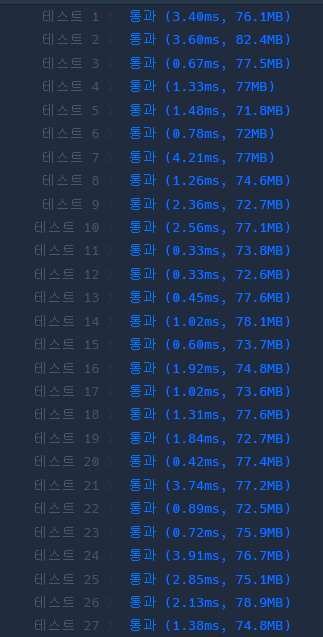

### 코드
```java
import java.util.*;

class Solution {
    
    static int[] dx = {0,0,1,-1};
    static int[] dy = {1,-1, 0,0};
    static String[][] map;
    static int cntMin = Integer.MAX_VALUE;
    
    class Point {
        int x, y, cnt;
        
        public Point(int x, int y, int cnt) {
            this.x = x;
            this.y = y;
            this.cnt = cnt;
        }
    }
    
    public int solution(String[] board) {
        int answer = 0;
        int n = board.length;
        int m = board[0].length();
        map = new String[n][m];
        
        int startX = 0;
        int startY = 0;
        int goalX = 0;
        int goalY = 0;
        for (int i = 0; i < n; i++) {
            String tmp = board[i];
            
            for (int j = 0; j < m; j++) {
                map[i][j] = tmp.substring(j, j+1);
                
                // 시작점
                if (map[i][j].equals("R")) {
                    startX = i;
                    startY = j;
                }
                if (map[i][j].equals("G")) {
                    goalX = i;
                    goalY = j;
                }
            }
        }
        
        Queue<Point> q = new LinkedList<>();
        boolean[][] visited = new boolean[n][m];
        
        q.add(new Point(startX, startY, 0));
        visited[startX][startY] = true;
        
        int result = 0;
        while (!q.isEmpty()) {
            Point now = q.poll();
            
            // 도착점인 경우 - 종료
            if (now.x == goalX && now.y == goalY) {
                return now.cnt;
            }
            
            for (int i = 0; i < 4; i++) {
                int tmpX = now.x;
                int tmpY = now.y;
                
                // 이동할 수 있을 때까지 한 방향으로 계속 이동!
                while ( 0 <= tmpX && tmpX < n
                       && 0 <= tmpY && tmpY < m
                       && !map[tmpX][tmpY].equals("D")
                ) {
                    tmpX += dx[i];
                    tmpY += dy[i];
                }
                // 정상 범위
                tmpX -= dx[i];
                tmpY -= dy[i];
                
                // 큐에 넣을 필요X
                if (visited[tmpX][tmpY]) continue;
                if (tmpX == now.x && tmpY == now.y) continue;
                
                visited[tmpX][tmpY] = true;
                q.add(new Point(tmpX, tmpY, now.cnt + 1));
            }
            
        }
        
        return -1;
    }
}
```
