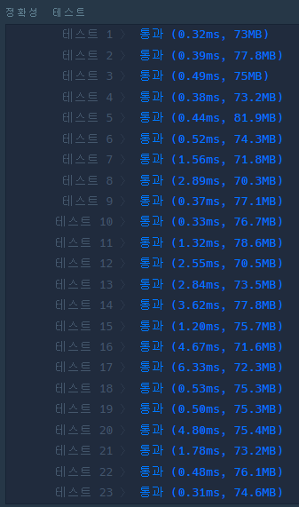

### 코드
```java
import java.util.*;

class Solution {
    
    class Node {
        int x;
        int y;
        int cnt;
        
        Node (int x, int y, int cnt) {
            this.x = x;
            this.y = y;
            this.cnt = cnt;
        }
    }
    
    static int[] dx = {0,0,1,-1};
    static int[] dy = {1,-1,0,0};
    static char[][] graph;
    static int n,m;
    static int startX, startY;
    static int leverX, leverY;
    static int endX, endY;
    
    public int BFS(int startX, int startY, int endX, int endY) {
        Queue<Node> q = new LinkedList<>();
        boolean[][] visited = new boolean[n][m];
        
        q.add(new Node(startX, startY, 0));
        visited[startX][startY] = true;
        
        while (!q.isEmpty()) {
            Node now = q.poll();
            
            if (now.x == endX && now.y == endY) {
                return now.cnt;
            }
            
            for (int i = 0; i < 4; i++) {
                int nx = now.x + dx[i];
                int ny = now.y + dy[i];
                
                if (0 <= nx && nx < n && 0 <= ny && ny < m) {
                    if (!visited[nx][ny] && graph[nx][ny] != 'X') {
                        q.add(new Node(nx, ny, now.cnt + 1));
                        visited[nx][ny] = true;
                    }
                }
            }
        }
        return -1;
    }
    
    public int solution(String[] maps) {        
        n = maps.length;
        m = maps[0].length();
        
        graph = new char[n][m];
        for (int i = 0; i < n; i++) {
            graph[i] = maps[i].toCharArray();
            
            for (int j = 0; j < m; j++) {
                if (graph[i][j] == 'S') {
                    startX = i;
                    startY = j;
                } else if (graph[i][j] == 'L') {
                    leverX = i;
                    leverY = j;
                } else if (graph[i][j] == 'E') {
                    endX = i;
                    endY = j;
                }
            }
        }
        
        // 1. 레버까지 최단 경로
        // start ~ lever
        // cnt는 Node에 저장, 근데 visited에 저장해도 될듯 - BFS는 처음 방문이 최소니까
        int cntLever = BFS(startX, startY, leverX, leverY);
        
        // 2. 출구까지 최단 경로
        int cntEnd = BFS(leverX, leverY, endX, endY);
        
        if (cntLever == -1 || cntEnd == -1) {
            return -1;
        }
        
        return cntLever + cntEnd;
    }
}
```

