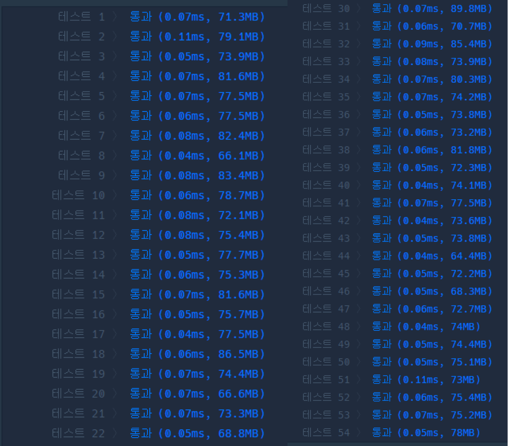

### 코드
```java
class Solution {
    public boolean isStrike(String[][] board, String target) {
        // 대각선
        String mid = board[1][1];
        if (target.equals(board[0][0]) && target.equals(board[2][2]) && target.equals(mid)) {
            return true;
        }
        if (target.equals(board[0][2]) && target.equals(board[2][0]) && target.equals(mid)) {
            return true;
        }
        
        // 행
        for (int i = 0; i < 3; i++) {
            int cnt = 0;
            for (int j = 0; j < 3; j++) {
                if (board[i][j].equals(target)) {
                    cnt++;
                }
            }
            if (cnt == 3) {
                return true;
            }
        }
        
        // 열
        for (int i = 0; i < 3; i++) {
            int cnt = 0;
            for (int j = 0; j < 3; j++) {
                if (board[j][i].equals(target)) {
                    cnt++;
                }
            }
            if (cnt == 3) {
                return true;
            }
        }
        
        return false;
    }
    
    public int solution(String[] board) {
        String[][] map = new String[3][3];
        for (int i = 0; i < 3; i++) {
            String tmp = board[i];
            for (int j = 0; j < 3; j++) {
                map[i][j] = tmp.substring(j, j+1);
            }
        }
        
        int cntO = 0;
        int cntX = 0;
        //  O, X 각각 갯수 세기
        for (int i = 0; i < 3; i++) {
            for (int j = 0; j < 3; j++) {
                if (map[i][j].equals("O")) {
                    cntO++;
                } else if (map[i][j].equals("X")) {
                    cntX++;
                }
            }
        }
        
        int answer = 1;
        // 1. cntO >= cntX 가 아닐 경우
        if (cntO != cntX && cntO != cntX+1) {
            answer = 0;
        }

        // 2-1. O가 스트라이크인 경우 - O가 1개 더 많아야
        if (isStrike(map, "O")) {
            if (cntO != cntX + 1) {
                answer = 0;
            }
        }
        
         // 2-2. 스트라이크인 경우 - O,X의 갯수가 같아야
        if (isStrike(map, "X")) {
            if (cntO != cntX) {
                answer = 0;
            }
        }
        return answer;
    }
}
```

