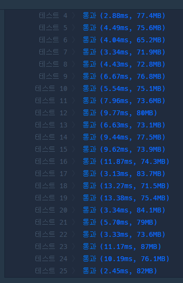

### 코드

- 모든 점에서 시작하기(방문X, 섬이면 시작 가능)
- 각 섬마다 bfs로 총 식량값 구하기

```java
import java.util.*;

class Solution {
    
    static boolean[][] visited;
    static int[][] graph;
    static int[] dx = {0,0,1,-1};
    static int[] dy = {1,-1,0,0};
    static int n;
    static int m;
    
    public int bfs(int x, int y) {
        Queue<int []> q = new LinkedList<>();
        q.add(new int[]{x, y});
        visited[x][y] = true;
        
        int cnt = 0;
        while(!q.isEmpty()){
            int[] now = q.poll();
            int nowX = now[0];
            int nowY = now[1];
            int nowCnt = graph[nowX][nowY];
            cnt += nowCnt;
            
            // 방문할 수 있으면
            for (int i = 0; i < 4; i++) {
                int nx = nowX + dx[i];
                int ny = nowY + dy[i];
                if (0 <= nx && nx < n && 0 <= ny && ny < m) {
                    if (!visited[nx][ny] && graph[nx][ny] != -1) {
                        visited[nx][ny] = true;
                        q.add(new int[]{nx, ny});
                    }
                }
            }

        }
        return cnt;
    }

    public int[] solution(String[] maps) {
        n = maps.length;
        m = maps[0].length();
        visited = new boolean[n][m];
        
        graph = new int[n][m];
        for (int i = 0; i< n; i++) {
            String tmp = maps[i];
            for (int j = 0; j < m; j++) {
                String num = tmp.substring(j, j+1);
                if (num.equals("X")) {
                    graph[i][j] = -1;
                } else {
                    graph[i][j] = Integer.parseInt(num);
                }
            }
        }
        
        ArrayList<Integer> arr = new ArrayList<>();
        
        // 시작은 모든 점에서!
        for (int i = 0; i < n; i++) {
            for (int j = 0; j < m; j++) {
                if (!visited[i][j] && graph[i][j] != -1) {
                    arr.add(bfs(i, j));
                }
            }
        }
        
        Collections.sort(arr);
        int[] answer = arr.stream()
                        .mapToInt(Integer::intValue)
                        .toArray();
    
        if (answer.length == 0) {
            return new int[] {-1};
        }
        return answer;
    }
}
```

