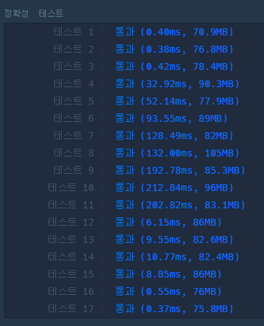

- [상한 하한](https://jackpot53.tistory.com/33)
- [시소 짝꿍](https://ksb-dev.tistory.com/266)

### 코드

### 1. 경우의 수
- 시간 줄이기
  - 오름차순 + 배수 조합 사용 (4:3, 4:2, 3:2)
  - 이전 숫자와 같으면 cnt 재사용


```java
import java.util.*;

class Solution {
    
    public boolean compare(int a, int b) {
        if (a == b ||
            a * 4 == b * 3 ||
            a * 4 == b * 2 ||
            a * 3 == b * 2 ) {
            return true;
        }
        return false;
    }
    
    public long solution(int[] weights) {
        long answer = 0;
        Arrays.sort(weights); // *오름 차순 정렬
        
        // nC2 각각의 케이스 비교하기
        int cnt = 0;
        for (int i = 0; i < weights.length-1; i++) {

            for (int j = i+1; j < weights.length; j++) {
                
                // 이전 숫자와 같다면, 이전 숫자의 cnt 갯수 활용하기
                if (i > 0 && weights[i] == weights[i-1]) {
                    cnt -= 1;
                    break;
                }
                
                if (j == i + 1) {
                    cnt = 0;
                }
                
                //  두 숫자가 균형을 맞출 수 있는 지 확인!
                if (compare(weights[i], weights[j])) {
                    cnt += 1;      
                }
            }
            
            // 항상 더해주기
            answer += cnt;
        }
        return answer;
    }
}
```




### 2. 이진탐색
- 상한 - 하한으로 갯수 구하기
- 십만 * log(십만) -> 백만
```java
import java.util.*;

class Solution {
    
    static int[][] rates = {{1,1}, {4,3}, {4,2}, {3,2}};
    
    public int upper(int target, int start, int end, int[] arr) {
        
        int left = start;
        int right = end;
        int mid = (left + right)/2;
        while (left < right) {
            mid = (left + right)/2;
            if (target < arr[mid]) {
                right = mid;
            } else {
                left = mid + 1;
            }
        }
        return left;
    }
    
    public int lower(int target, int start, int end, int[] arr) {
        
        int left = start;
        int right = end;
        int mid = (left + right)/2;
        while (left < right) {
            mid = (left + right)/2;
            if (target <= arr[mid]) {
                right = mid;
            } else {
                left = mid + 1;
            }
        }
        return left;
    }
    
    public long solution(int[] weights) {
        long answer = 0;
        Arrays.sort(weights); // *오름 차순 정렬
        
        for (int[] rate : rates) {
            for (int i = 0; i < weights.length; i++) {
                
                int nowX = weights[i];
                
                // nowX에 해당하는 y값이 배열에 존재하는 지 체크
                // 아예 y가 정수로 안나오면 패스
                if ((nowX * rate[0] % rate[1]) != 0) continue;
                int findY = nowX * rate[0] / rate[1];
                
                int upperBound = upper(findY, i+1, weights.length, weights);
                int lowerBound = lower(findY, i+1, upperBound, weights);
                
                int tmp = upperBound - lowerBound;
                answer += tmp;
            }
        }
        return answer;
    }
}
```


