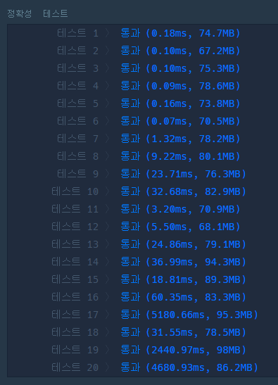

### 코드
```java
import java.util.*;

class Solution {
    public long solution(int cap, int n, int[] deliveries, int[] pickups) {
        long answer = 0;
        
        // 뒷 집부터 배달/수거하기 -> 배달/수거 중 최대값이 결과값
        // 트럭의 여유가 있으면 앞 집들도 처리하기
        
        
        // 해당 집의 방문 횟수는 (상자 - 1) / cap + 1
        
        for (int i = n-1; i >= 0; i--) {
            int deliveryCnt = 0;
            if (deliveries[i] != 0) {
                deliveryCnt = (deliveries[i] - 1) / cap + 1;
            }
            int pickupCnt = 0;
            if (pickups[i] != 0) {
                pickupCnt = (pickups[i] - 1) / cap + 1;
            }
            
            // 현재 집이 0이면 방문 할 필요X
            if (deliveryCnt == 0 && pickupCnt == 0) {
                continue;
            }
            
            // 최대 방문 횟수 구하고, 이동거리까지 답에 더해주기
            int maxCnt = Math.max(deliveryCnt, pickupCnt);
            answer += maxCnt * (i+1) * 2;
            
            // 각각 처리 가능한 상자수
            int deliveryCap = maxCnt * cap;
            int pickupCap = maxCnt * cap;

            // 현재 집보다 앞집들 값 변경해주기!
            // 현재 집에 가까운 앞집부터 계산해주어야 함!
            for (int j = i; j >= 0; j--) {
                if (deliveryCap == 0 && pickupCap == 0) {
                    break;
                }
                
                if (deliveryCap > 0) {
                    int now = Math.min(deliveryCap, deliveries[j]);
                    deliveries[j] -= now; // 해당 집의 수거할 상자 삭제
                    deliveryCap -= now; // 수거 가능한 상자 삭제
                }
                
                if (pickupCap > 0) {
                    int now = Math.min(pickupCap, pickups[j]);
                    pickups[j] -= now;
                    pickupCap -= now;
                }
            }
        }
        
        return answer;
    }
}
```


