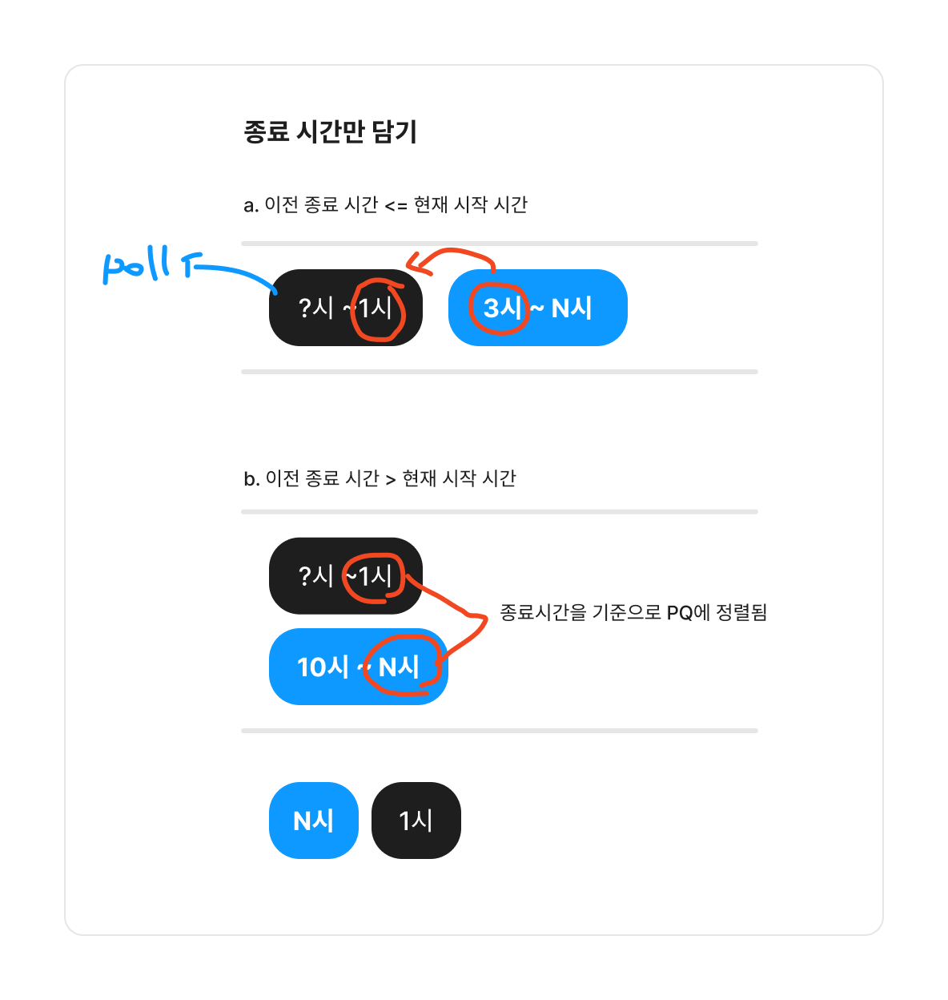
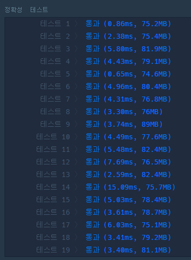

### 코드


- 시작 시간, 종료 시간 기준으로 정렬하기
- PQ에는 종료 시간만 넣어주고
- 매번 현재 시작 시간이랑 비교해서
  - 현재 예약이 있는 방에 들어갈 수 있는 지/새 방이 필요한 지
- PQ의 노드는 각 방의 마지막 종료 시간을 의미! => 총 필요한 방의 갯수는 PQ의 노드수

```java
import java.util.*;

class Solution {
    public int solution(String[][] book_time) {
        int answer = 0;
        int[][] times = new int[book_time.length][2];
        for (int i = 0; i < book_time.length; i++) {
            int start = Integer.parseInt(book_time[i][0].replace(":", ""));
            int end = Integer.parseInt(book_time[i][1].replace(":", ""));

            end += 10; // 종료시간 10분 더해주기
            int endHour = end / 100;
            int endMinute = end % 100;
            if (endMinute >= 60) {
                endHour += 1;
                endMinute -= 60;
            }
            end = endHour * 100 + endMinute;
            times[i][0] = start;
            times[i][1] = end;
        }

        Arrays.sort(times, new Comparator<int[]>() {
            @Override
            public int compare(int[] o1, int[] o2) {
                // 시작 시간이 빠른 순서대로
                if (o1[0] > o2[0]) {
                    return 1;
                } else if (o1[0] < o2[0]) {
                    return -1;
                } else {
                    // 도착 시간이 빠른 순서대로
                    if (o1[1] > o2[1]) return 1;
                    else return -1;
                }
            }
        });

        PriorityQueue<Integer> q = new PriorityQueue<>();

        for(int[] time : times){
            if(q.isEmpty()){
                q.add(time[1]); // 종료 시간 넣기
                continue;
            } else if((q.peek()) <= time[0]){ // 방들 중에 가장 빠른 종료시간이 현재 시작시간보다 이르다면, 
                                              // 해당 방에 추가, 가장 늦은 종료 시간은 현재 방의 종료시간으로 업데이트!
                q.poll();
                q.add(time[1]);
            } else {

                q.add(time[1]);
            }
        }

        return q.size(); // 각 방별로 가장 늦은 종료 시간들이 q에 남아있음!

    }
}
```


